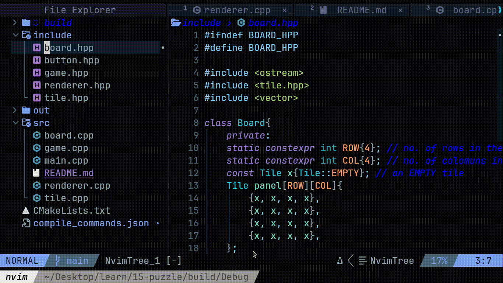

# 15 Puzzle Game with NCurses

A simple 15 Puzzle game implemented in C++ using NCurses for terminal-based rendering, designed for learning purposes. The game supports mouse input for an intuitive user experience. The codebase is modular, with game logic encapsulated in the `Board` class and rendering handled by a separate `Renderer` class. The renderer is implemented using NCurses but can be adapted to use any graphics library, making the core logic highly portable.


## Features

- **Classic 15 Puzzle Gameplay**: Slide tiles to arrange numbers 1-15 in order on a 4x4 grid.
- **Mouse Input**: Click tiles to move them, leveraging NCurses' mouse support.
- **Modular Design**:
  - Game logic is contained in the `Board` class, independent of rendering.
  - Rendering is handled by a `Renderer` class, allowing flexibility to use other graphics libraries.
- **Terminal-Based UI**: Built with NCurses for a lightweight, text-based interface.
- **Learning-Focused**: Clean, commented code to help others understand the implementation.

## Requirements

- A Unix-like system (Linux, macOS, or WSL on Windows)
- NCurses library (`libncurses-dev` on Debian/Ubuntu, `ncurses` on macOS via Homebrew)
- C++ compiler (e.g., `g++` with C++11 or later)
- CMake (version 3.10 or higher)

## Installation

1. **Install NCurses**:

   - On Ubuntu/Debian: `sudo apt-get install libncurses5-dev libncursesw5-dev`
   - On macOS: `brew install ncurses`

2. **Clone the Repository**:

   ```bash
   git clone https://github.com/rijwan-dev/15puzzle.git
   cd 15-puzzle-ncurses
   ```

3. **Build the Game**:

   ```bash
   mkdir build
   cd build
   cmake ..
   make
   ```

4. **Run the Game**:

   ```bash
   ./15puzzle
   ```

## How to Play

- The game starts with a shuffled 4x4 grid containing numbers 1-15 and one empty space.
- Use the mouse to click a tile adjacent to the empty space to slide it into the empty spot.
- The goal is to arrange the tiles in numerical order (1-15, with the empty space in the bottom-right corner).
- Press `q` or click the "Quit" button to exit the game.

## Project Structure

```
├── CMakeLists.txt
├── include
│   ├── board.hpp
│   ├── button.hpp
│   ├── game.hpp
│   ├── renderer.hpp
│   └── tile.hpp
└── src
    ├── board.cpp
    ├── game.cpp
    ├── main.cpp
    ├── README.md
    ├── renderer.cpp
    └── tile.cpp
```

- `include/`: Header files for the game components.
  - `board.hpp`: Defines the `Board` class with game logic (shuffling, moving tiles, checking win conditions).
  - `button.hpp`: Defines the `Button` class for UI elements like the quit button.
  - `game.hpp`: Manages the overall game state and ties components together.
  - `renderer.hpp`: Declares the NCurses-based `Renderer` class for handling input and output.
  - `tile.hpp`: Defines the `Tile` class for individual puzzle tiles.
- `src/`: Source files implementing the game logic and rendering.
- `CMakeLists.txt`: CMake configuration for building the project.

## Extending the Game

The modular design allows the NCurses renderer to be replaced with another graphics library (e.g., SDL, SFML) by implementing a new renderer class that handles input and drawing, while keeping the `Board` logic unchanged.

## Acknowledgments

- Built as a learning exercise to explore NCurses and modular game design.
- Inspired by the classic 15 Puzzle and terminal-based game development.

---

Happy puzzling!
